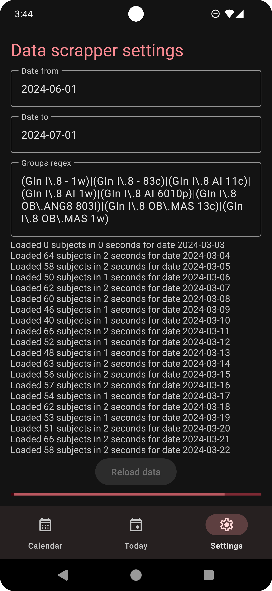
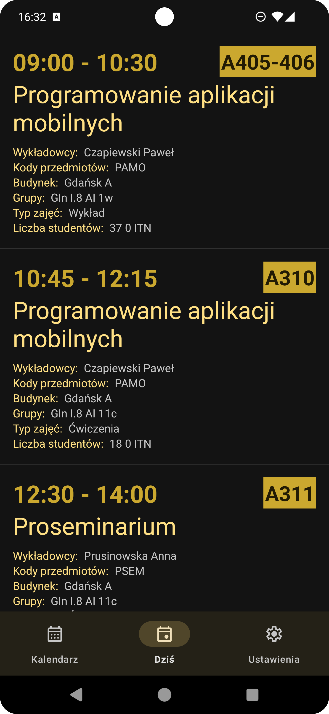
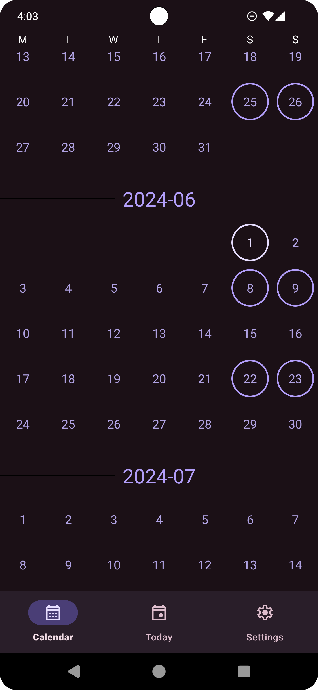
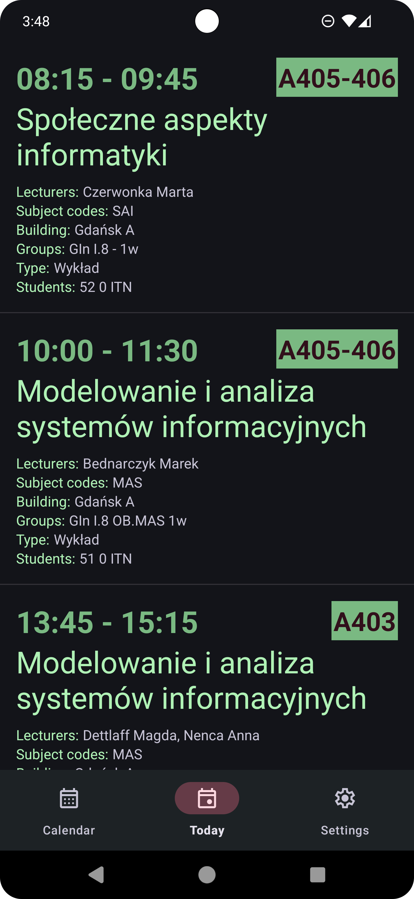
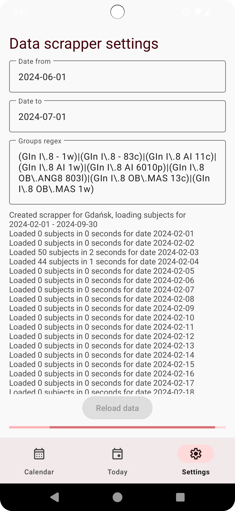
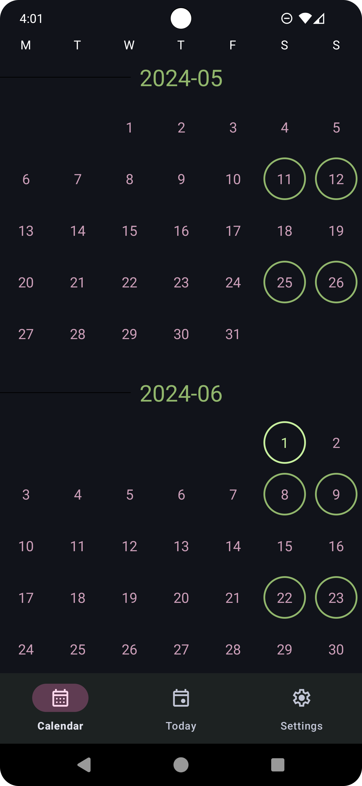
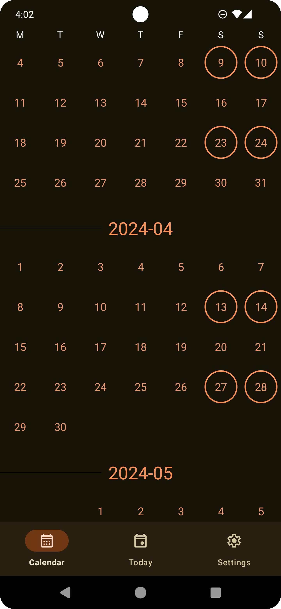
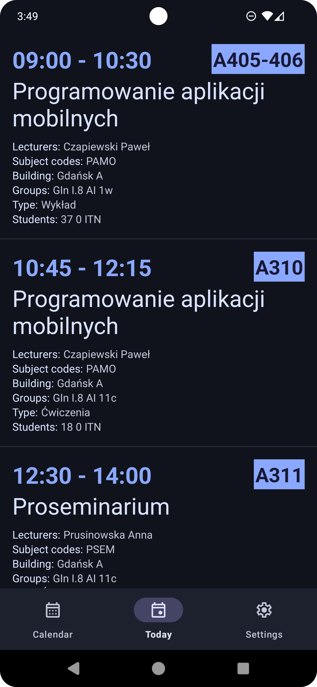
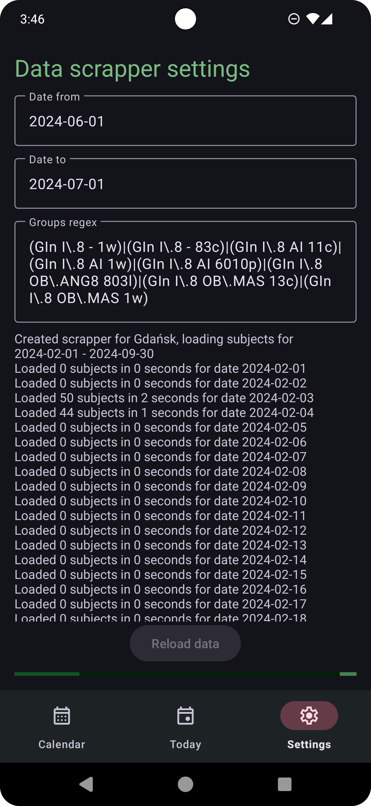

# PJPL - Mobile schedule made by idiots for idiots

|            |            |            |
|------------|------------|------------|
|  |  |  |
|  |  |  |
|  |  |  |

Welcome to PJATK Student Scheduler, your go-to Android app for managing your academic schedule at PJATK (Polish-Japanese Academy of Information Technology). This app allows you to seamlessly view, organize, and track your subjects and classes, ensuring you never miss a lecture or assignment deadline again.
Features
1. Automatic Data Retrieval

    Web Scraping: Utilizes web scraping techniques to automatically fetch subject details, including interval, room, lecturers, codes, names, type, building, groups, and student count, from PJATK's web pages.
    Dynamic Updates: Periodically refreshes data from web sources to ensure the most up-to-date information is available to users.

2. Intuitive Calendar Interface

    Calendar View: Presents subjects and classes in a visually appealing and intuitive calendar interface, allowing users to easily visualize their schedule at a glance.
    Color-Coding: Assigns distinct colors to subjects for easy identification and organization.

3. Comprehensive Subject Details

    Subject Detail View: Provides comprehensive details for each subject, including title, and additional information such as location, instructor

4. Enhanced User Experience

    Search Functionality: Enables users to quickly find subjects by course name, instructor
    Filtering Options: Offers filtering options to organize subjects by course, date, or other attributes for better management.

Monkey tests

https://github.com/ElectroluxV2/PJATK-PAMO-Schedule-app/assets/29741129/247f560d-d6b1-4b87-bbbb-5c671adfc306

Getting Started
Prerequisites

    Android Studio installed on your development machine.
    Basic knowledge of Kotlin programming language and Android app development.

Installation

    Clone the repository to your local machine.

    bash

    git clone https://github.com/ElectroluxV2/PJATK-PAMO-Schedule-app.git

    Open the project in Android Studio.
    Build and run the project on an Android device or emulator.

Contributing

Contributions are welcome! If you'd like to contribute to PJATK Student, please follow these steps:

    Fork the repository.
    Create a new branch (git checkout -b feature/your-feature-name).
    Make your changes.
    Commit your changes (git commit -am 'Add new feature').
    Push to the branch (git push origin feature/your-feature-name).
    Create a new pull request.

License

This project is licensed under the MIT License - see the LICENSE file for details.
Acknowledgments

    This project was inspired by the need for a convenient and efficient way to manage academic schedules at PJATK.

Authors
Mateusz Budzisz
Wiktor Rostkowski
